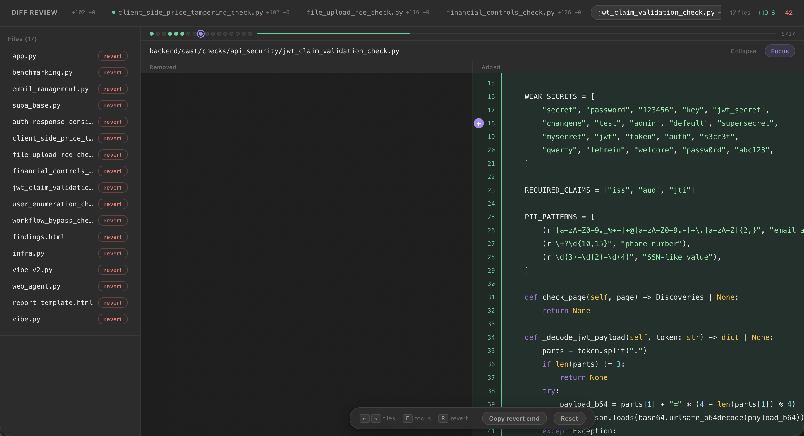

# justshowmediff

Review AI-generated code changes in your browser. No IDE needed.

Claude Code, Codex, and other AI agents write code on your machine -- but `git diff` in the terminal is hard to read, and firing up a full IDE just to review changes is overkill. justshowmediff generates a self-contained HTML file and opens it. Side-by-side diff, syntax highlighting, one command.



### The workflow

You don't edit the diff -- you edit the prompt.

1. Agent writes code
2. `justshowmediff` -- review in browser
3. Tell the agent what's wrong
4. Repeat until it looks right
5. Commit

Works from anywhere: terminal, SSH, phone. The HTML file is self-contained -- share it, open it on any device.

## Install

```
go install github.com/msoedov/justshowmediff@latest
```

Or download from [releases](https://github.com/msoedov/justshowmediff/releases).

### From source

```bash
git clone https://github.com/msoedov/justshowmediff.git
cd justshowmediff
sh install.sh
```

## Usage

```bash
justshowmediff                      # unstaged changes
justshowmediff --staged             # staged changes
justshowmediff HEAD~3               # arbitrary git diff args
justshowmediff main..feature-branch # compare branches
git diff | justshowmediff           # pipe from stdin
justshowmediff -o review.html       # write to file instead of opening
```

## Why not X?

- `git diff` -- hard to read, no side-by-side, no syntax highlighting
- GitHub PR view -- requires a push, a PR, and internet
- VS Code / IDE -- heavy, need the full editor running
- diff-so-fancy / delta -- still terminal-based, still line-by-line

justshowmediff: single binary, zero dependencies, no server, no config. Opens in 200ms.

### Claude Code Stop hook (auto-review)

Auto-open the diff every time Claude finishes working. Add to `.claude/settings.json`:

```json
{
  "hooks": {
    "Stop": [
      {
        "matcher": "",
        "command": "justshowmediff 2>/dev/null || true"
      }
    ]
  }
}
```

Now every time Claude hands control back to you, the diff opens automatically in your browser.

### Claude Code skill

Add a `/diff` slash command to Claude Code. Create `.claude/skills/diff.md`:

```markdown
When the user runs /diff, execute `justshowmediff` to open the current
unstaged changes in a browser-based diff viewer.

If the user says /diff --staged, run `justshowmediff --staged` instead.

Do not commit, do not modify files. Just show the diff.
```

Then in your session:

```
> /diff
> /diff --staged
```

## How it works

Runs `git diff`, embeds the output into a self-contained HTML file in `/tmp`, and opens it. No server needed. Mobile optimized.

## License

MIT
